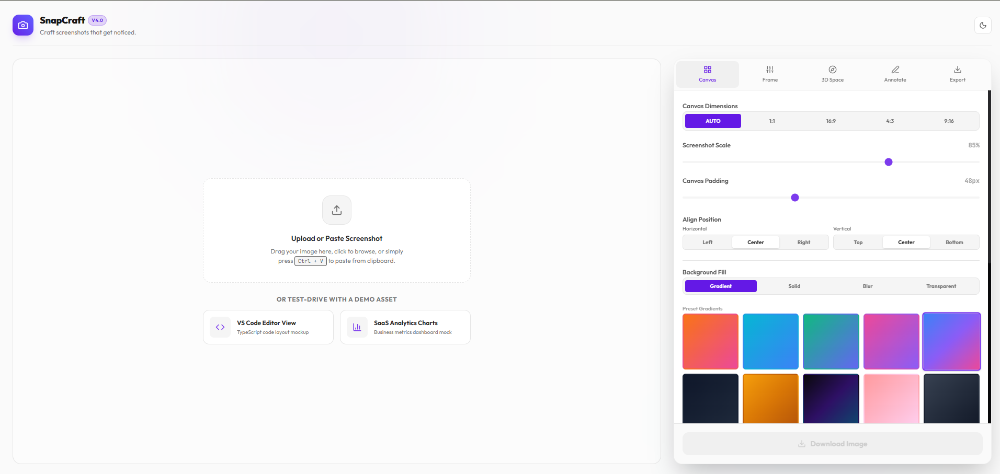
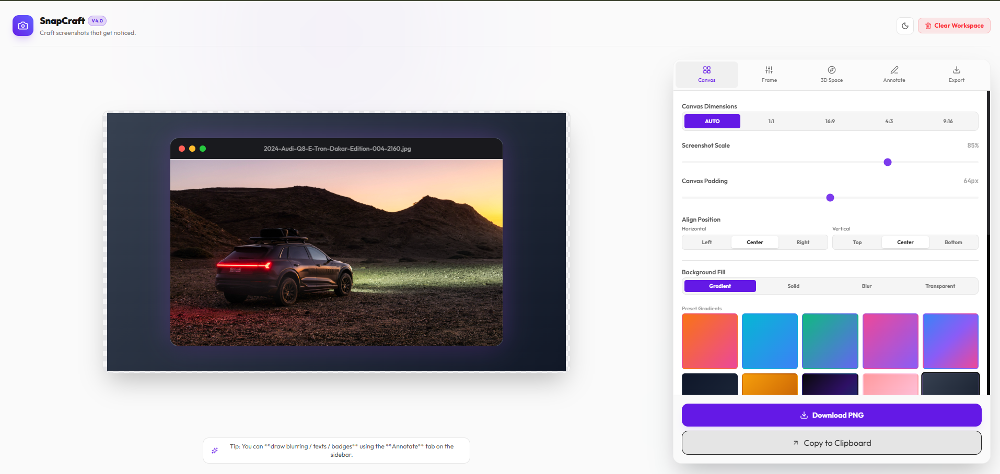

# SnapCraft

> **Craft screenshots that get noticed.**

SnapCraft is a browser-based screenshot beautifier that transforms plain screenshots into polished, presentation-ready visuals — no design skills required. Drop in an image, pick a background, add a device frame, and export in seconds.

---

## Screenshots


*Upload screen with canvas controls and gradient presets*


*A screenshot wrapped in a macOS window frame on a custom background*

---

## Features

- **Canvas Control** — Set canvas dimensions (Auto, 1:1, 16:9, 4:3, 9:16), adjust padding, screenshot scale, and alignment.
- **Background Fill** — Choose from gradient presets, solid colors, blur effects, or a transparent background.
- **Device Frames** — Wrap your screenshot in macOS, Windows, or browser window frames.
- **3D Space** — Apply perspective and depth transforms for eye-catching product shots.
- **Annotations** — Draw blur regions, add text labels, and place badges directly on the canvas.
- **Export** — Download as PNG or copy directly to clipboard. Choose format and resolution before saving.
- **Light & Dark Mode** — Full theme support with a polished UI in both modes.
- **Paste Support** — Paste images from clipboard with `Ctrl + V`.

---

## Getting Started

### Install dependencies

```sh
npm install
```

### Run the dev server

```sh
npm run dev

# or open directly in browser
npm run dev -- --open
```

### Build for production

```sh
npm run build
npm run preview
```

---

## Tech Stack

- [SvelteKit](https://kit.svelte.dev/) — Full-stack Svelte framework
- [Tailwind CSS](https://tailwindcss.com/) — Utility-first styling
- [html-to-image](https://github.com/bubkoo/html-to-image) — Canvas-to-image export
- [Lucide Svelte](https://lucide.dev/) — Icon library

---

## License

MIT
